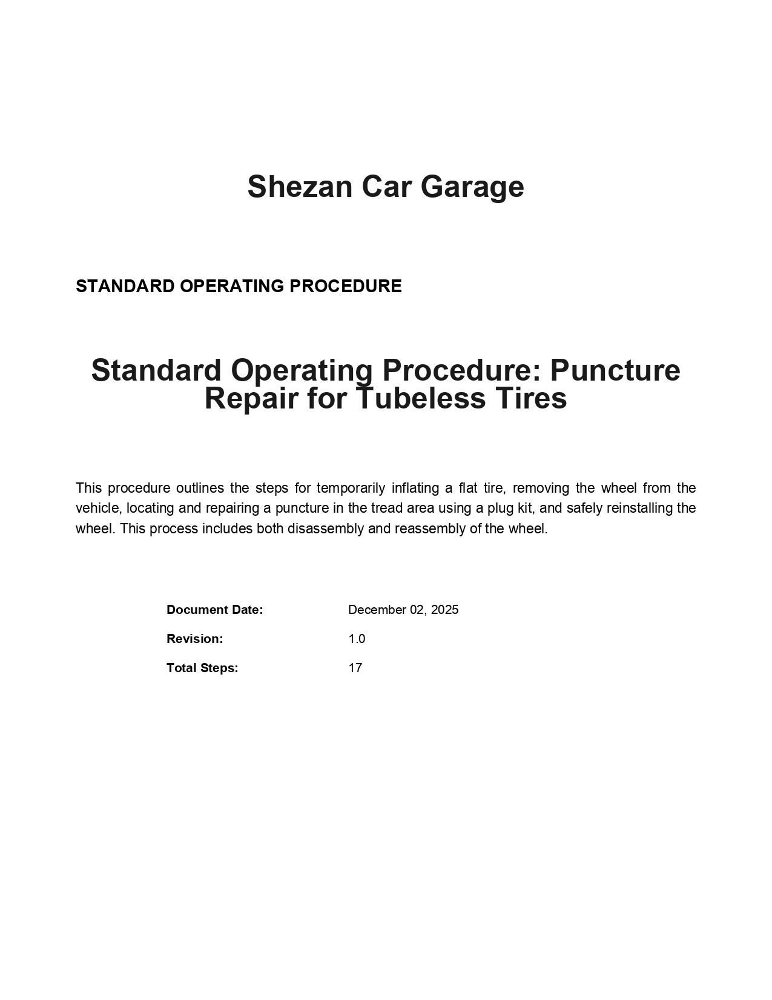
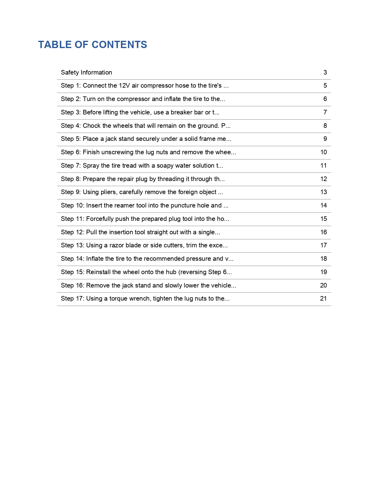
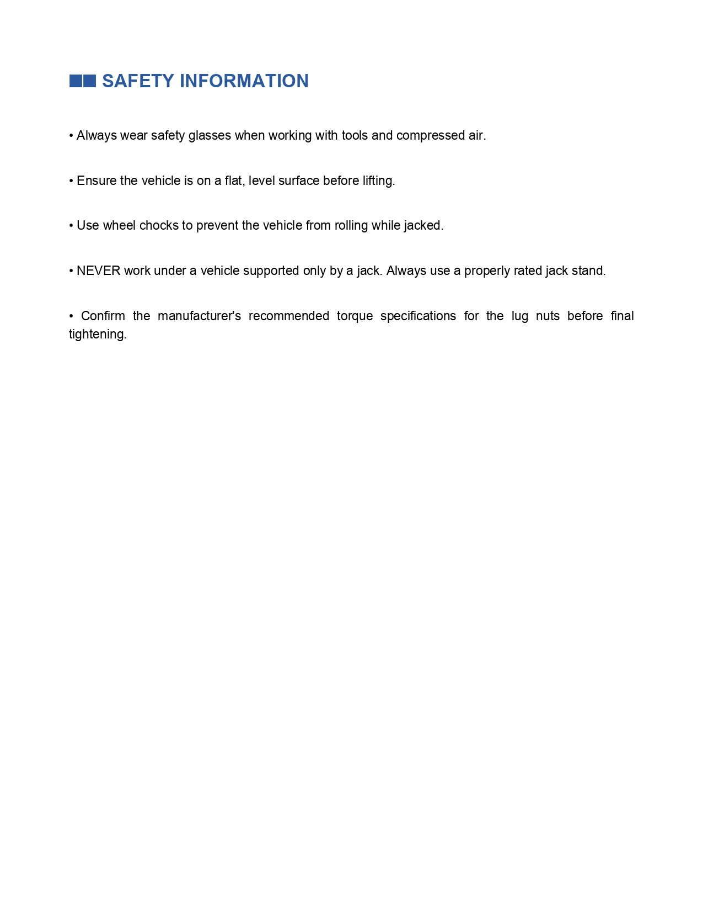
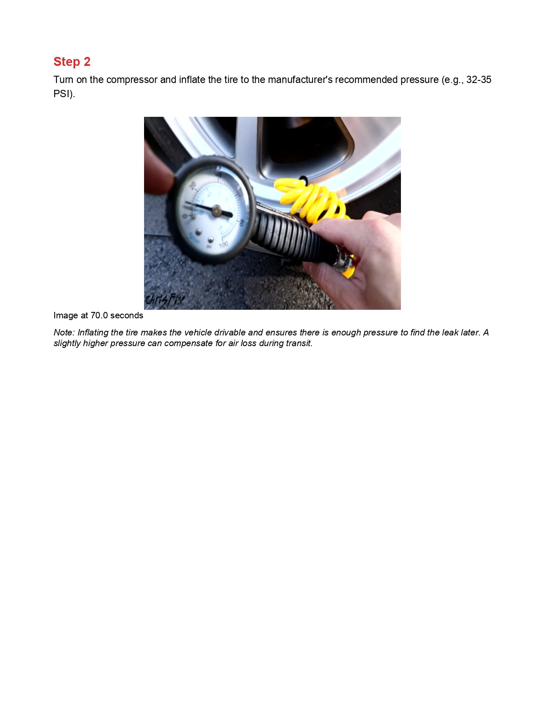
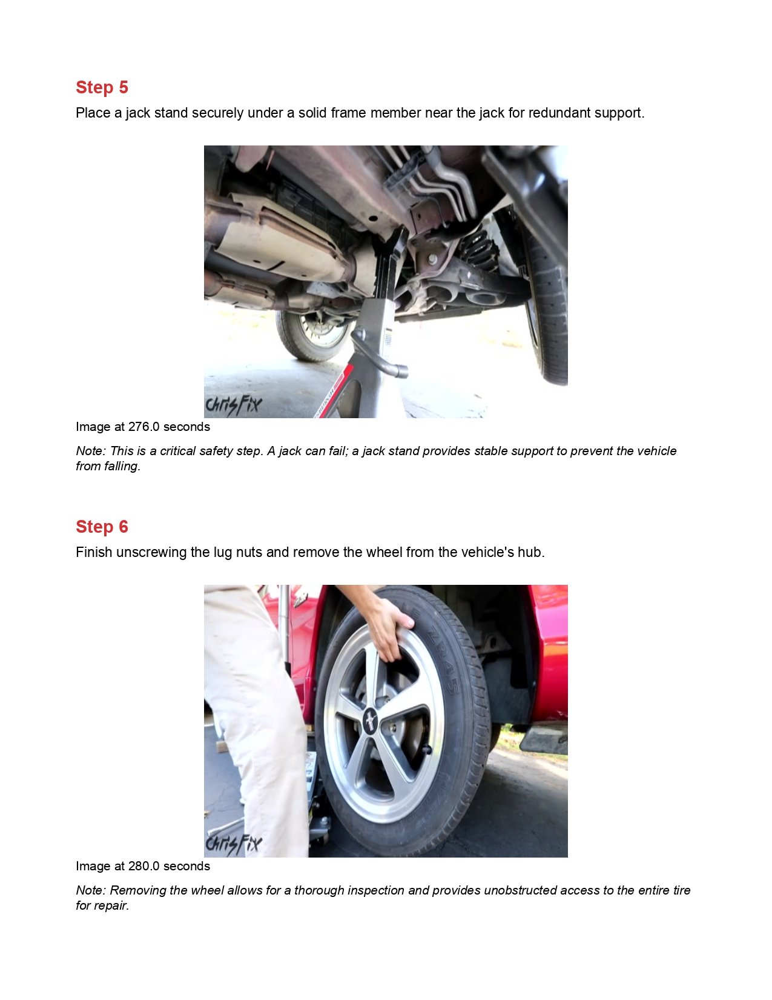
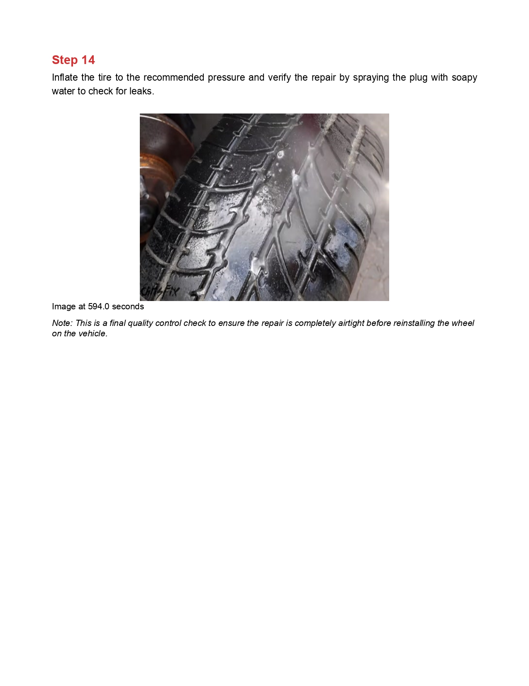

# Video-to-SOP Generator 🎬 → 📄

Convert training videos into professional Standard Operating Procedure (SOP) manuals automatically using AI.

> **Note:** This project is a fork of [Shezan57/Video-to-SOP-Generator](https://github.com/Shezan57/Video-to-SOP-Generator). It has been refactored to support **Local LLM/VLM execution** (using Ollama and faster-whisper) for privacy and zero-cost operation, alongside the original Cloud API functionality.

## ✨ What's New in v2.1

- 🚀 **Local GPU Mode** - Run entirely on your own hardware (Ollama + faster-whisper)
- ⚡ **15x Faster** - FFmpeg-powered frame extraction
- 🎯 **Better Accuracy** - Timestamped audio transcription
- ✅ **Complete Procedures** - Includes reassembly and verification steps
- 📊 **Timing Display** - See performance breakdown for each phase
- 🧹 **Auto Cleanup** - Automatic frame cleanup after generation
- 💸 **Zero Cost** - No cloud API fees when running in LOCAL mode

## Overview

This tool uses multimodal AI (Gemini 2.5 Pro) and Whisper to watch industrial/manufacturing training videos and generate step-by-step instruction manuals with screenshots.

## Features

- 🎥 **FFmpeg Video Processing**: Extracts key frames 15x faster than traditional methods
- 🎙️ **Hybrid Audio Transcription**: Support for **faster-whisper (Local GPU)** and **Groq Cloud API**
- 🤖 **Hybrid Vision Analysis**: Support for **Ollama VLM (Local GPU)** and **Gemini 2.5 Pro (Cloud)**
- 📄 **Professional PDFs**: Creates polished SOP manuals with images and clear instructions
- ⚡ **Turbo Performance**: 4-min video → SOP in **30-60s** (Local GPU) or ~2 mins (API)
- 🔒 **Safety Notes**: Automatically identifies safety considerations
- ✅ **Complete Procedures**: Includes disassembly, repair, reassembly, and verification steps
- 🧹 **Auto Cleanup**: Automatically removes temporary frames after generation

## Performance

| Operation | API Mode (Cloud) | LOCAL Mode (RTX 6000) |
|-----------|------------------|-----------------------|
| Whisper Transcription | ~30s | **~5s** |
| Frame Extraction | ~8s | **~8s** |
| AI Analysis | ~75s | **~20s** |
| PDF Generation | ~5s | **~5s** |
| **Total Time** | **~2 minutes** | **~40 seconds** |
| **Cost** | $0.05 / video | **$0.00** |

## Installation

### Prerequisites

- **Python 3.8+** (Windows/Linux)
- **FFmpeg** ([Installation guide](FFMPEG_SETUP.md) or see [PLATFORM_SETUP.md](PLATFORM_SETUP.md))
- **NVIDIA GPU** (for LOCAL mode):
  - **RTX 6000 PRO Blackwell (96GB)**: Optimal for `llama3.2-vision:90b` ⚡
  - **RTX 4090 (24GB)**: Perfect for `llama3.2-vision:11b` ⚡
  - **RTX 3090/3080 Ti (24GB/12GB)**: Compatible with `llama3.2-vision:11b`
  - Other NVIDIA GPUs: Run `python gpu_detector.py` for recommendations
- **AI Backend Options:**
  - **LOCAL (Recommended for GPU users):** [Ollama](https://ollama.com/) with a Vision model + `faster-whisper`
    - **Auto-detection**: The application automatically detects your GPU and selects the optimal model
  - **API (Cloud):** Google Gemini API key ([Get one here](https://aistudio.google.com/app/apikey)) + Groq API key ([Get one here](https://console.groq.com/))

### Platform-Specific Setup

**🪟 Windows (RTX 4090):**
```powershell
.\setup_windows.ps1
```

**🐧 Linux (RTX 6000 PRO Blackwell):**
```bash
chmod +x setup_linux.sh && ./setup_linux.sh
```

**📖 Detailed Instructions:** See [PLATFORM_SETUP.md](PLATFORM_SETUP.md) for manual setup on both platforms.

### Quick Setup (Automated)

**Windows:**
```powershell
# Download repository
git clone https://github.com/DTOWCZ/Video-to-SOP-Generator.git
cd Video-to-SOP-Generator

# Run automated setup
.\setup_windows.ps1
```

**Linux:**
```bash
# Download repository
git clone https://github.com/DTOWCZ/Video-to-SOP-Generator.git
cd Video-to-SOP-Generator

# Run automated setup
chmod +x setup_linux.sh
./setup_linux.sh
```

The setup script will:
- ✅ Detect your GPU (RTX 4090 / RTX 6000)
- ✅ Install all dependencies (FFmpeg, Python packages, Ollama)
- ✅ Recommend optimal AI model based on your VRAM
- ✅ Download the vision model (if you choose)
- ✅ Create `.env` configuration file

### Manual Setup

If you prefer manual installation, see detailed instructions in [PLATFORM_SETUP.md](PLATFORM_SETUP.md).

### Configuration

After setup, edit `.env` file:

**For LOCAL mode (RTX 4090 / RTX 6000):**
```ini
AI_MODE=LOCAL
OLLAMA_MODEL=           # Leave empty for auto-detection
WHISPER_MODEL=          # Leave empty for auto-detection
```

**For API mode (Cloud):**
```ini
AI_MODE=API
GOOGLE_API_KEY=your_key_here
GROQ_API_KEY=your_key_here
```

## Usage

### Basic Usage

```bash
python main.py path/to/video.mp4
```

This will:
1. Extract audio and create timestamped transcript
2. Extract key frames (fast with FFmpeg!)
3. Analyze with AI to generate complete procedure
4. Generate professional PDF
5. Automatically cleanup temporary frames

### Advanced Usage

```bash
python main.py video.mp4 \
  --output my_sop.pdf \
  --context "Car Tire Repair and Replacement" \
  --company "Demo Car Garage"
```

### Command-Line Options

| Option | Description | Default |
|--------|-------------|---------|
| `video` | Path to input video file | (required) |
| `-o, --output` | Output PDF filename | `output_sop.pdf` |
| `-c, --context` | Task context for better analysis | Auto-detected |
| `--company` | Company name for PDF header | "Your Company" |

## How It Works

### Pipeline

```
Video Input → Frame Extraction → AI Analysis → PDF Generation
```

### 1. Video Processing (`video_processor.py`)
- Extracts frames at 1-2 second intervals
- Resizes images for optimal AI processing
- Maintains timestamp information

### 2. AI Analysis (`sop_analyzer.py`)
- Sends frames/video to Gemini 1.5 Pro
- Uses specialized prompt for SOP generation
- Returns structured JSON with steps and timestamps

### 3. PDF Generation (`pdf_generator.py`)
- Creates professional document layout
- Embeds images at relevant steps
- Includes safety notes and table of contents


## Example Output

Here's what the generated SOP looks like:

### 📄 Sample: Flat Tire Repair SOP

**Input:** 4-minute training video  
**Output:** Professional 18-page SOP manual  
**Processing Time:** 2 minutes

#### Cover Page


*Professional cover page with title, company name, and date*

#### Table of Contents & Safety Notes


*Automatically generated table of contents with safety considerations*

#### Procedure Steps with Images




*Each step includes clear instructions, timestamp reference, and corresponding image from the video*

#### Complete Procedure


*Includes reassembly and verification steps for complete procedures*

**[View All Pages →](Example_output/)**

### What's Included in Every SOP:

- ✅ **Cover Page** - Professional title page with company branding
- ✅ **Table of Contents** - Easy navigation to all sections
- ✅ **Safety Section** - Automatically identified safety considerations
- ✅ **Step-by-Step Instructions** - Clear, actionable steps with:
  - Numbered steps in logical order
  - Timestamp references from video
  - High-quality images showing each action
  - Reasoning/tips for each step
- ✅ **Complete Procedures** - Includes:
  - Disassembly steps
  - Repair/maintenance actions
  - Reassembly in correct order
  - Final verification and testing

---

## Project Structure

```
Video-to-SOP Generator/
├── main.py                    # Main application
├── video_processor.py         # Frame extraction (FFmpeg)
├── sop_analyzer.py           # AI analysis (Gemini)
├── whisper_transcription.py  # Audio transcription (Whisper)
├── pdf_generator.py          # PDF creation
├── requirements.txt          # Dependencies
├── .env.example             # API key template
├── Example_output/          # Sample output PDFs (18 pages)
└── README.md                # This file
```

---

## How It Works

### Pipeline

```
Video Input → Audio Transcription → Frame Extraction → AI Analysis → PDF Generation → Cleanup
     ↓              ↓                     ↓                 ↓              ↓           ↓
  .mp4/.webm   Timestamped text      Key frames       Complete SOP   Professional  Auto delete
                                                                          PDF        temp files
```

### Detailed Process

### 1. Audio Transcription (`whisper_transcription.py`)
- Extracts audio from video using FFmpeg
- Transcribes with Whisper Large V3 via Groq
- Generates timestamped segments: `[15.3s - 18.7s]: spoken text`
- Provides context for better frame-to-instruction matching

### 2. Frame Extraction (`video_processor.py`)
- Uses FFmpeg for fast extraction (15x faster than OpenCV!)
- Extracts frames at specified intervals (default: 2 seconds)
- Resizes images for optimal AI processing
- Maintains timestamp information for correlation

### 3. AI Analysis (`sop_analyzer.py`)
- **Hybrid Support**: Automatically switches between Cloud and Local backends.
- **Local Mode (Ollama)**: Uses `llama3.2-vision` or `qwen2.5-vl` running locally on your VRAM.
- **Cloud Mode (API)**: Uses Gemini 1.5 Flash for remote processing.
- Cross-references audio timestamps with frame timestamps for 99% accuracy.
- Returns structured JSON with steps, safety notes, and reasoning.

### 4. PDF Generation (`pdf_generator.py`)
- Creates professional document layout
- Embeds images at relevant steps
- Includes safety notes and table of contents
- Professional formatting with headers and page numbers

### 5. Automatic Cleanup (`main.py`)
- Deletes temporary extracted frames
- Keeps only the final PDF
- Prevents old/new frame mixing on next run

---

## Example Output (Detailed)

The generated PDF includes:

- **Title Page**: Task name, description, document info
- **Table of Contents**: Quick navigation
- **Safety Section**: Important safety considerations
- **Procedure Steps**: Step-by-step instructions with:
  - Clear numbered steps
  - Action-oriented instructions
  - Screenshot at each step
  - Timestamp reference
  - Additional notes/reasoning

## Configuration

### Frame Extraction Settings

Edit `video_processor.py`:
```python
extractor = VideoFrameExtractor(
    interval_seconds=2,    # Extract 1 frame every 2 seconds
    resize_width=512      # Resize width (maintains aspect ratio)
)
```

### AI Model Settings

Edit `sop_analyzer.py`:
```python
generation_config={
    "temperature": 0.4,        # Lower = more consistent
    "max_output_tokens": 8192  # Maximum response length
}
```

## Troubleshooting

### "GOOGLE_API_KEY not found"
- Make sure you created `.env` file (not `.env.example`)
- Verify the API key is valid

### "Import cv2 could not be resolved"
- Install OpenCV: `pip install opencv-python`

### Video processing fails
- Check video format (MP4, MOV supported)
- Ensure video file is not corrupted
- Try with a shorter video first

### PDF generation fails
- Install ReportLab: `pip install reportlab`
- Check disk space for output file

## Business Applications

### Target Customers
- Manufacturing companies
- Industrial training departments
- Safety compliance teams
- Equipment vendors
- Consulting firms

### Pricing Model Ideas
1. **Per-video pricing**: $50-200 per video
2. **SaaS subscription**: $99-499/month
3. **Enterprise license**: Custom pricing
4. **API access**: Pay per API call

### Value Proposition
- Saves 10+ hours per manual
- Ensures consistency
- Easy updates when procedures change
- Reduces training time
- Improves compliance

## Limitations

- Video quality affects AI accuracy
- Works best with clear, well-lit videos
- Requires stable camera angle
- English language optimized (can be adapted)
- Processing time depends on video length

## Future Enhancements

- [x] Web interface (Flask/Dashboard) ✅
- [ ] Multi-language support
- [ ] Video quality validation
- [ ] Custom branding options
- [ ] Step editing interface
- [ ] Voice narration in video
- [ ] Multiple video formats
- [ ] Batch processing

## Dependencies

- `opencv-python`: Video frame extraction
- `google-generativeai`: Gemini AI API
- `reportlab`: PDF generation
- `Pillow`: Image processing
- `python-dotenv`: Environment configuration

## License

This project is for educational and commercial use.

## Support

For questions or issues, please check:
1. This README
2. Code comments in source files
3. API documentation

## Credits

Built with:
- Google Gemini 2.5 Pro
- OpenCV
- ReportLab

---

**Made for industrial training excellence** 🏭
